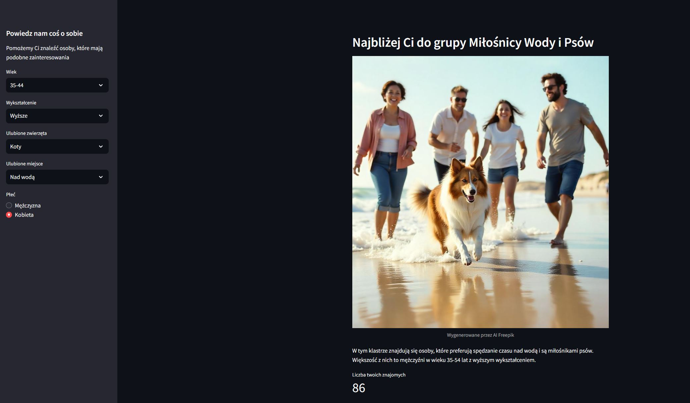
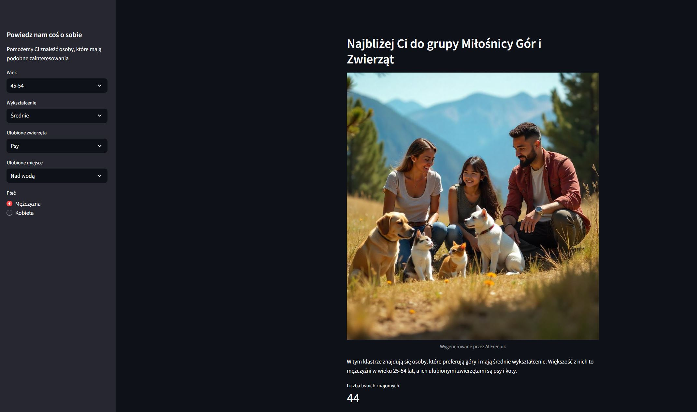
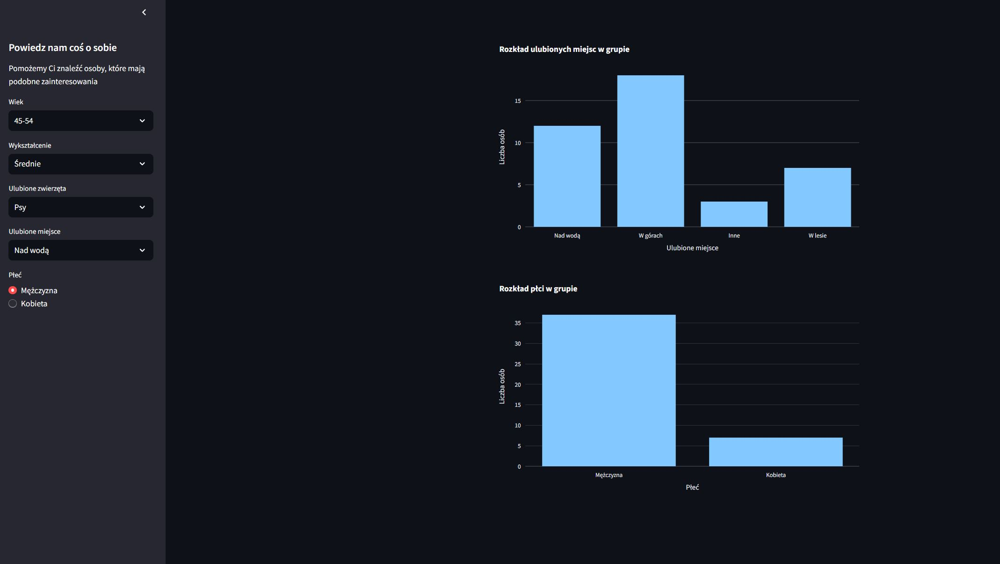

# **"Find Friends" – analiza klastrów na podstawie danych z ankiety**
**2025/01**  

**Aplikacja wykorzystuje uczenie maszynowe do grupowania użytkowników na podstawie ich odpowiedzi w ankiecie. Dzięki PyCaret i Streamlit można szybko sprawdzić, do której grupy użytkownik pasuje najlepiej pod względem wieku, wykształcenia, zainteresowań i preferencji. Aplikacja prezentuje szczegółowe statystyki dotyczące każdej grupy, pomagając użytkownikom znaleźć osoby o podobnych zainteresowaniach.**

**Technologie: Python, Pandas, JSON, Streamlit, PyCaret, Plotly, scikit-learn**

<a href="app.py" download class="md-button md-button--primary">Pobierz Aplikację</a>

**Przykładowe wizualizacje**

**Przykładowa analiza**

