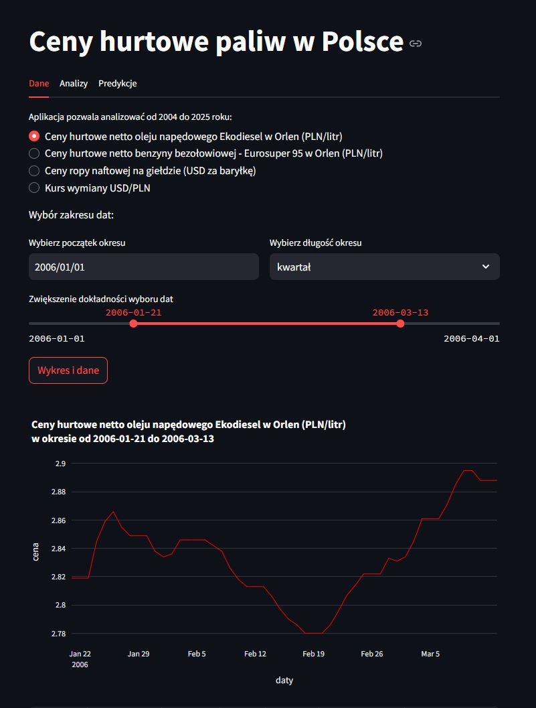
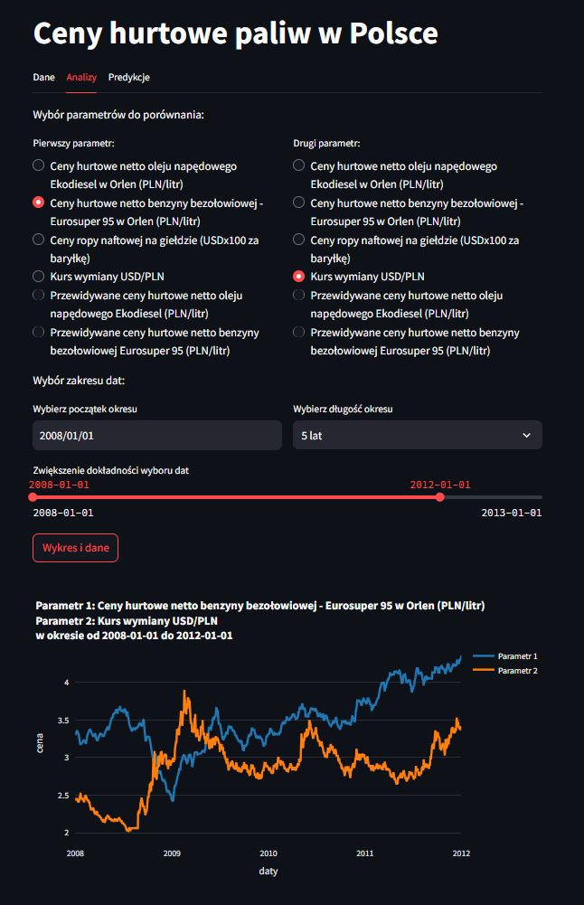
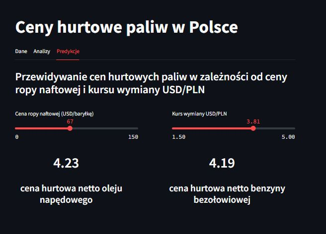

# **"Fuel Predict" – Analiza i predykcja cen paliw**
**2025/02**  

**Jest to interaktywna aplikacja do analizy i prognozowania hurtowych cen paliw w Polsce. Umożliwia użytkownikom przeglądanie historycznych danych cenowych (2004-2024), analizowanie zależności między czynnikami ekonomicznymi (takimi jak cena ropy naftowej i kurs wymiany USD/PLN) oraz generowanie prognoz cen paliw przy użyciu modeli uczenia maszynowego.**

**Technologie: Python, Pandas, Streamlit, PyCaret, Plotly, scikit-learn**

<a href="app.py" download class="md-button md-button--primary">Pobierz Aplikację</a>

**Przykładowe wizualizacje:**  

`Dane`

`Analizy`

`Predykcje`

