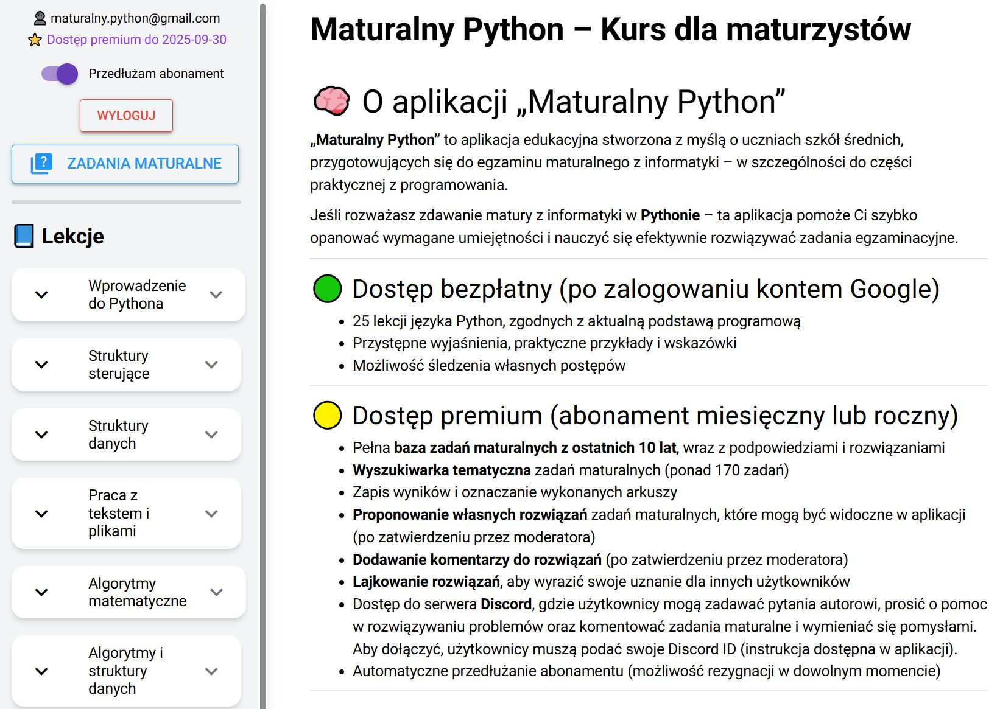
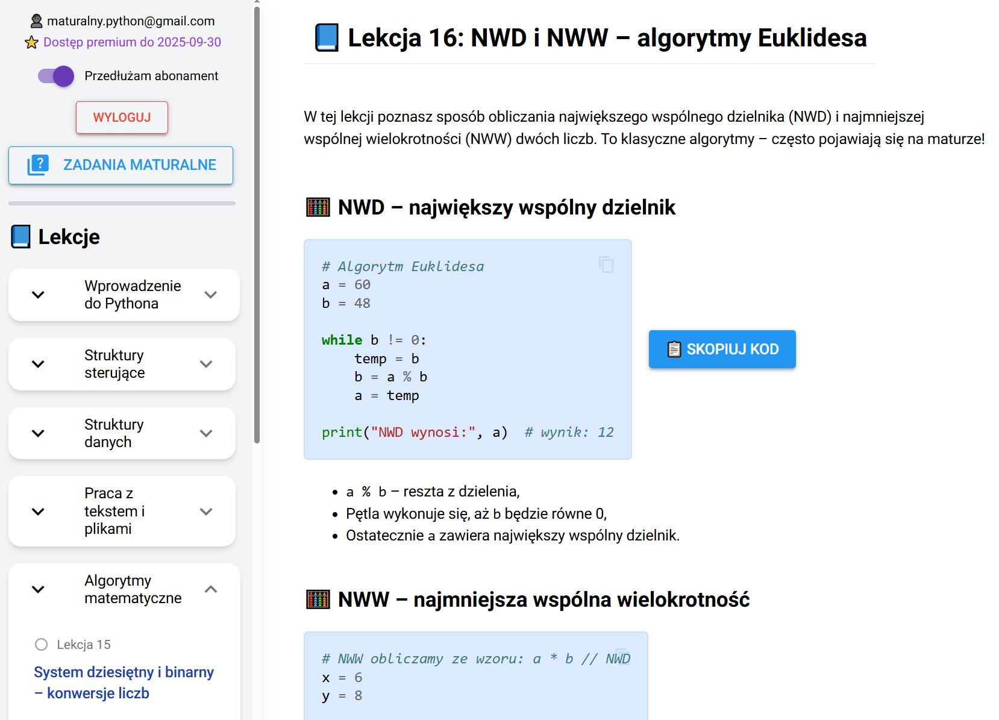
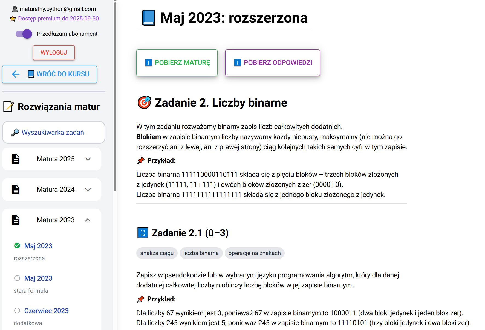
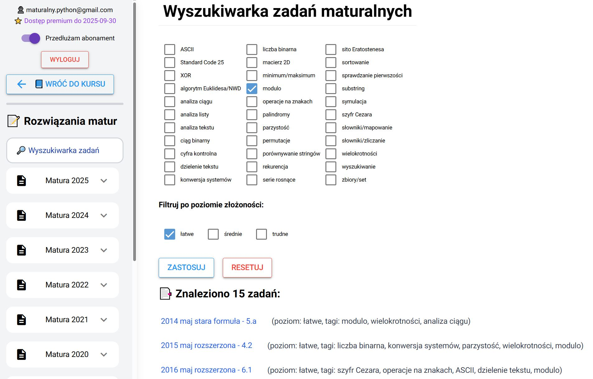

# Maturalny Python 🎓🐍
**od 2025/05** 

**Maturalny Python** to aplikacja edukacyjna w Pythonie (niceGUI) z bazą danych i autoryzacją Google w Supabase, płatnościami Stripe, integracją Discorda oraz hostingiem i zadaniami automatycznymi (cron jobs) w Render.

Aplikacja **[Maturalny Python](https://maturalnypython.pl)** skierowana jest do osób, które chcą poznać podstawy programowania w języku Python.  
Powstała przede wszystkim z myślą o **uczniach szkół średnich przygotowujących się do matury z informatyki**.

---

## 📘 Co znajdziesz w aplikacji?

Szkolenie składa się z **dwóch części**:

### 1. Lekcje programowania (dostęp darmowy)
- Dostęp po zalogowaniu kontem Google  
- **25 lekcji** zgodnych z wymaganiami egzaminu maturalnego  
- Przystępne wyjaśnienia i wskazówki  
- Liczne przykłady z gotowym kodem do uruchomienia  

Ekran startowy aplikacji:
  

Przykładowa lekcja:

### 2. Zadania maturalne (część premium)
- Ponad **160 zadań maturalnych z informatyki (od 2014 roku)**  
- Podpowiedzi i przykładowe rozwiązania z komentarzami  
- Wyszukiwarka tematyczna zadań, z możliwością filtrowania wg trudności  

Przykładowe zadania maturalne:
  

Wyszukiwarka zadań:

---

## ⭐ Korzyści dla użytkowników premium

- Możliwość proponowania własnych rozwiązań zadań (po akceptacji moderatora)  
- Komentowanie rozwiązań innych użytkowników  
- Ocenianie rozwiązań (system polubień 👍)  

---

## 💬 Społeczność

Użytkownicy premium otrzymują dostęp do **dedykowanego serwera Discord**, gdzie mogą:
- prosić autora szkolenia o pomoc (techniczna i merytoryczna),  
- komentować egzaminy w specjalnych kanałach,  
- wymieniać się doświadczeniami i osiągnięciami,  
- kontaktować się z opiekunami grup w dedykowanych kanałach.  

---

## ⚖️ Warunki korzystania

Aplikacja przeznaczona jest **wyłącznie do celów edukacyjnych**.  
Jakiekolwiek wykorzystanie komercyjne wymaga pisemnej zgody właściciela.  

Dla grup dostępne są elastyczne oferty – status premium nadawany jest **bezpośrednio wybranym kontom Google**, z pominięciem platformy Stripe.  

---

## 🛠️ Technologie

- Python (niceGUI)  
- Supabase (PostgreSQL + Google OAuth2)  
- Stripe API (płatności)  
- Discord API  
- Render (hosting i cron jobs)  

---

## 🔗 Linki

- 🌐 [Maturalny Python – Strona główna](https://maturalnypython.pl)  