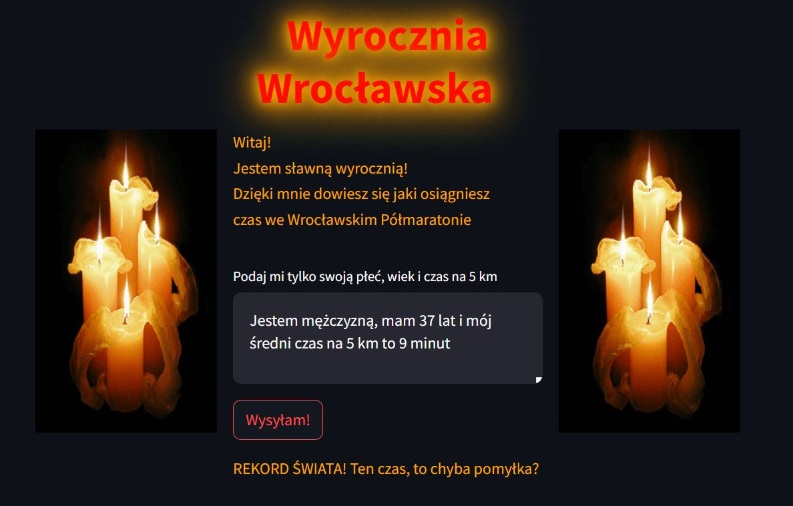
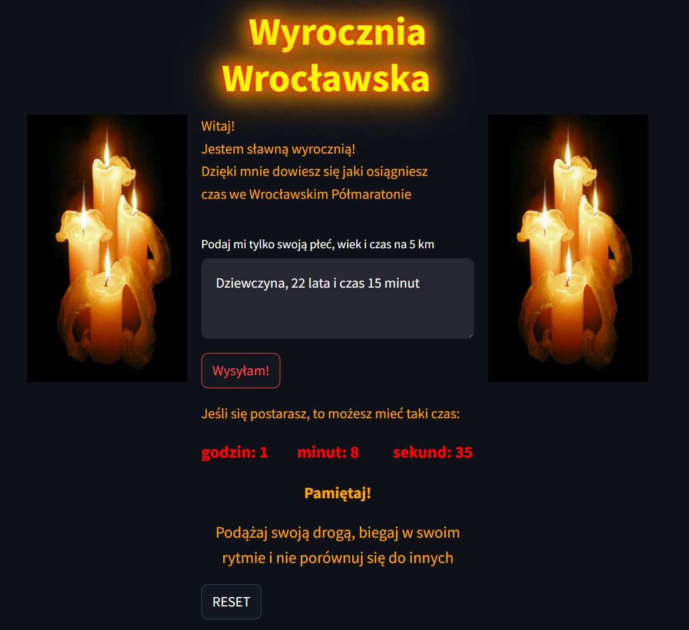

# **"Race Oracle – Wyrocznia Wrocławska" – Predykcja wyników biegowych za pomocą uczenia maszynowego**
**2025/01**  

**Jest to aplikacja wykorzystująca uczenie maszynowe do analizy wyników Półmaratonu Wrocławskiego. Pozwala na przewidywanie końcowego czasu biegu na podstawie danych demograficznych i międzyczasów uczestników.**

**Projekt obejmuje przetwarzanie i analizę danych z zawodów biegowych, konwersję czasów na format liczbowy, eliminację brakujących lub błędnych rekordów oraz wybór najlepszego modelu uczenia maszynowego przy użyciu PyCaret. Model jest wizualizowany pod kątem błędów i ważności cech, a następnie finalizowany i zapisywany w chmurze Digital Ocean.**

**Aplikacja umożliwia szybkie prognozowanie wyników na podstawie rzeczywistych danych, co może być przydatne zarówno dla biegaczy, jak i organizatorów zawodów w optymalizacji strategii i analizy wyników.**

**Technologie: Python, Pandas, Streamlit, PyCaret, OpenAI API, Langfuse, Boto3, dotenv, JSON, Digital Ocean / AWS S3**

    <a href="Race_Oracle.ipynb" class="md-button md-button--primary">Pobierz Notebook</a>
    <a href="app.py" download class="md-button md-button--primary">Pobierz Aplikację</a>

**Przykładowe wizualizacje:**  

`Za krótki czas`

`Predykcja wyniku`

